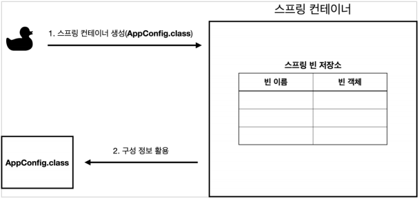
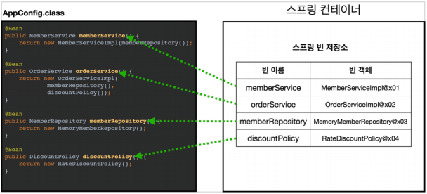
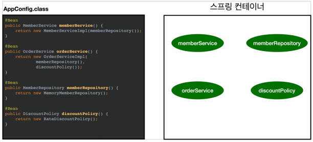
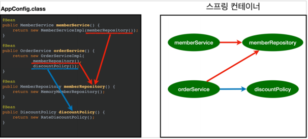
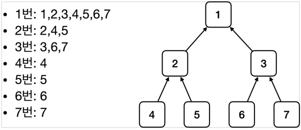

# 스프링 컨테이너
- `ApplicationContext`를 스프링 컨테이너라 한다.

- 기존에는 개발자가 `AppConfig`를 사용해서 직접 객체를 생성하고 DI를 했지만, 이제부터는 스프링 컨테이너를 통해서 사용한다.

- 스프링 컨테이너는 `@Configuration`이 붙은 `AppConfig`를 설정(구성) 정보로 사용한다. 여기서 `@Bean`이라 적힌 메서드를 모두 호출해서 반환된 객체를 스프링 컨테이너에 등록한다.
이렇게 스프링 컨테이너에 등록된 객체를 **스프링 빈** 이라 한다.

- 스프링 빈은 `@Bean`이 붙은 메서드의 명을 스프링 빈의 이름으로 사용한다.(`memberService`, `orderService`)

- 이전에는 개발자가 필요한 객체를 `AppConfig` 를 사용해서 직접 조회했지만, 이제부터는 스프링 컨테이너를 통해서 필요한 스프링 빈(객체)를 찾아야 한다.
스프링 빈은 `applicationContext.getBean()` 메서드를 사용해서 찾을 수 있다.

- 기존에는 개발자가 직접 자바코드로 모든 것을 했다면 이제부터는 스프링 컨테이너에 객체를 스프링 빈으로 등록하고, 스프링 컨테이너에서 스프링 빈을 찾아서 사용하도록 변경되었다.

- 코드가 약간 더 복잡해진 것 같은데, 스프링 컨테이너를 사용하면 어떤 장점이 있을까?

# 스프링 컨테이너 생성

스프링 컨테이너가 생성되는 과정을 알아보자.
```java

// 스프링 컨테이너 생성
Applicationcontext applicationContext = new AnnotaionConfigApplicationContext(AppConfig.class);

```

- `ApplicationContext`를 스프링 컨테이너라 한다.
- `ApplicationContext`는 인터페이스다.
- 스프링 컨테이너는 XML을 기반으로 만들 수 있고, 애노테이션 기반의 자바 설정 클래스로 만들 수 있다.
- 직전에 `AppConfig`를 사용했던 방식이 애노테이션 기반의 자바 설정 클래스로 스프링 컨테이너를 만든 것이다.
- 자바 설정 클래스를 기반으로 스프링 컨테이너 (`ApplicationContext`)를 만들어보자
    - `new AnnotationConfigApplicationContext(AppConfig.class);`
    - 이 클래스는 `ApplicationContext`인터페이스의 구현체이다.
> 참고 : 더 정확히는 스프링 컨테이너를 부를 때 `BeanFactory`, `ApplicationContext`로 구분해서 이야기 한다. `BeanFactory`를 직접 사용하는 경우는 거의 없으므로 일반적으로 `ApplicationContext` 를 스프링 컨테이너라 한다.

# 스프링 컨테이너의 생성 과정
1. 스프링 컨테이너 생성

    
    - `new AnnotaionConfigApplicationContext(Appconfig.class)`
    - 스프링 컨테이너를 생성할 때는 구성 정보를 지정해주어야 한다.
    - 여기서는 `AppConfig.class`를 구성 정보로 지정했다.

2. 스프링 빈 등록

    
    - 스프링 컨테이너는 파라미터로 넘어온 설정 클래스 정보를 사용해서 스프링 빈을 등록한다.
    
    ## 빈 이름
    - 빈 이름은 메서드 이름을 사용한다.
    - 빈 이름을 직접 부여할 수도 있다.
    - `@Bean(name = "memberService2")`

> **주의 : 빈 이름은 항상 다른 이름으로 부여** 해야 한다. 같은 이름을 부여하면, 다른 빈이 무시되거나, 기존 빈을 덮어버리거나 설정에 따라 오류가 발생한다.

3. 스프링 빈 의존관계 설정 - 준비

    

4. 스프링 빈 의존관계 설정 - 완료
    
    
    - 스프링 컨테이너느 설정 정보를 참고해서 의존관계를 주입(DI)한다.
    - 단순히 자바 코드를 호출하는 것 같지만, 차이가 있다. 이 차이는 뒤에 싱글톤 컨테이너에서 설명한다.

## 참고
스프링은 빈을 생성하고, 의존관계를 주입하는 단계가 나누어져 있다. 그런데 이렇게 자바 코드로 스프링 빈을 등록하면 생성자를 호출하면서 의존관계 주입도 한번에 처리된다. 여기서는 이해를 돕기 위해 개념적으로 나누어 설명했다.
자세한 내용은 의존관계 자동 주입에서 다시 탐색한다.

## 정리
스프링 컨테이너를 생성하고, 설정(구성) 정보를 참고해서 스프링 빈도 등록하고, 의존관계도 설정했다.
이제 스프링 컨테이너에서 데이터를 조회해보자.

# 컨테이너에 등록된 모든 빈 조회
- 모든 빈 출력하기
    - 실행하면 스프링에 등록된 모든 빈 정보를 출력할 수 있다.
    - `ac.getBeanDefinitionNames()` : 스프링에 등록된 모든 빈 이름을 조회한다.
    - `ac.getBean()` : 빈 이름으로 빈 객체(인스턴스)를 조회한다.
- 애플리케이션 빈 출력하기
    - 스프링 내부에서 사용하는 빈은 제외하고, 내가 등록한 빈만 출력한다.
    - 스프링 내부에서 사용하는 빈은 `getRole()` 로 구분할 수 있다.
        - `ROLE_APPLICATION` : 일반적으로 사용자가 정의한 빈
        - `ROLE_INFRASTRUCTURE` : 스프링이 내부에서 사용하는 빈
        
# 스프링 빈 조회 - 동일한 타입이 둘 이상
- 타입으로 조회시 같은 타입의 스프링 빈이 둘 이상이면 오류가 발생한다. 이때는 빈 이름을 지정하자.
- `ac.getBeansOfType()`을 사용하면 해당 타입의 모든 빈을 조회할 수 있다.

# 스프링 빈 조회 - 상속 관계
- 부모 타입으로 조회하면, 자식 타입도 함께 조회한다.
- 그래서 모든 자바 객체의 최고 부모인 `Object` 타입으로 조회하면, 모든 스프링 빈을 조회한다.

