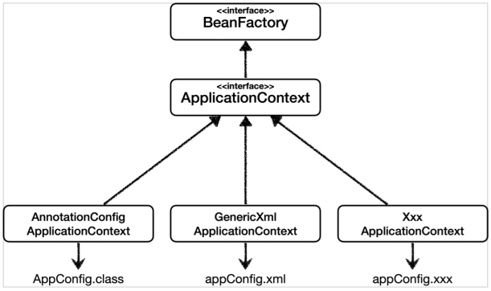
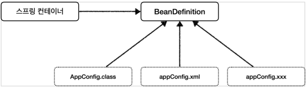
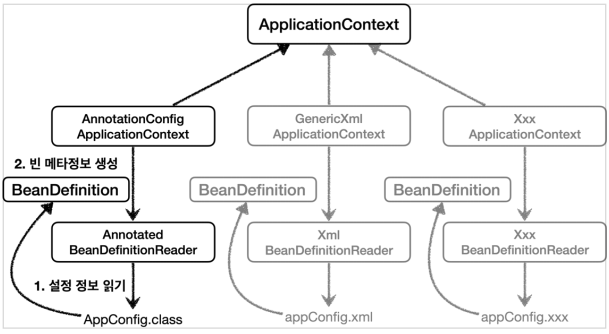

# 다양한 형식 지원 - 자바 코드, XML
- 스프링 컨테이너는 다양한 형식의 설정 정보를 받아드릴 수 있게 유연하게 설계되어 있다.
- 자바 코드, XML, Groovy 등등

## 애노테이션 기반 자바 코드 설정 사용
- 지금까지 했던 것이다.
- `new AnnotationConfigApplicationContext(AppConfig.class)`
- `AnnotationConfigApplicationContext` 클래스를 사용해 자바 코드로 된 설정 정보를 넘기면 된다.

## XML 설정 사용
- 최근에는 스프링 부트를 많이 사용하면서 XML 기반의 설정은 잘 사용하지 않는다. 아직 많은 레거시 프로젝트들이 XML로 되어 있고, 또 XML을 사용하면 컴파일 없이 빈 정보를 변경할 수 있는 장점도 있으므로 한번 쯤 배워두는 것도 괜찮다.
- `appConfig.xml` 과 `AppConfig.java` 설정 정보를 비교해보면 거의 비슷하다는 것을 알 수 있다.
- xml 기반으로 설정하는 것은 최근에 잘 사용하지 않으므로, xml설정 학습은 이정도로 하고 필요하면 아래 공식 레퍼런스 문서를 확인하자.
    - [https://spring.io/projects/spring-framework](https://spring.io/projects/spring-framework)

## 스프링 빈 설정 메타 정보 - BeanDefinition
- 스프링은 어떻게 이런 다양한 설정 형식을 지원하는 것일까? 그 중심에는 `BeanDefinition` 이라는 추상화가 있다.
- 쉽게 이야기하자면 **역할과 구현을 개념적으로 나눈 것**이다.
    - XML을 읽어서 BeanDefinition을 만들면 된다.
    - 자바 코드를 읽어서 BeanDefinition을 만들면 된다.
    - 스프링 컨테이너는 자바 코드인지, XML인지 몰라도 된다. 오직 BeanDefinition만 알면 된다.
- `BeanDefinition`을 빈 설정 메타정보라 한다.
    - `@Bean`, `<bean>` 당 각각 하나씩 메타 정보가 생성된다.
- 스프링 컨테이너는 이 메타정보를 기반으로 스프링 빈을 생성한다.

## 코드 레벨

- `AnnotationConfigApplicationContext`는 `AnnotatedBeanDefinitionReader`를 사용해서 `AppConfig.class`를 읽고 `BeanDefinition`을 생성한다.
- `GenericXmlApplicationContext`는 `XmlBeanDefinitionReader`를 사용해서 `appConfig.xml`설정 정보를 읽고 `BeanDefinition`을 생성한다.
- 새로운 형식의 설정 정보가 추가 되면, XxxBeanDefinitionReader를 만들어서 `BeanDefinition`을 생성하면 된다.

## BeanDefinition 살펴보기
### BeanDefinition 정보
- `BeanClassName` : 생성할 빈의 클래스명(자바 설정 처럼 팩토리 역할의 빈을 사용하면 없음)
- `factoryBeanName` : 팩토리 역할의 빈을 사용할 경우 이름, 예) appConfig
- `factoryMethodName`: 빈을 생성할 팩토리 메서드 지정, 예) memberService
- `Scope`: 싱글톤(기본값)
- `lazyInit` : 스프링 컨테이너를 생성할 때 빈을 생성하는 것이 아니라, 실제 빈을 사용할 때 까지 최대한 생성을 지연처리 하는지 여부
- `InitMethodName` : 빈의 생명주기가 끝나서 제거하기 직전에 호출되는 메서드 명
- `DestroyMethodName` : 빈의 생명주기가 끝나서 제거하기 직전에 호출되는 메서드 명
- `Constructor arguments, Properties` : 의존관계 주입에서 사용한다. (자바 설정 처럼 팩토리 역할의 빈을 사용하면 없음)

### 정리
- BeanDefinition에 대해서는 너무 깊이 이해하기 보다는, 스프링이 다양한 형태의 설정 정보를 BeanDefinition으로 추상화해서 사용하는 것 정도만 이해하면 된다.
- 가끔 스프링 코드나 스프링 관련 오픈 소스의 코드를 볼 때, BeanDefinition 이라는 것이 보일 때가 있다. 이때 이러한 메커니즘을 떠올리면 된다.
