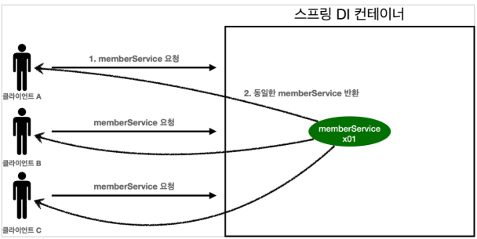
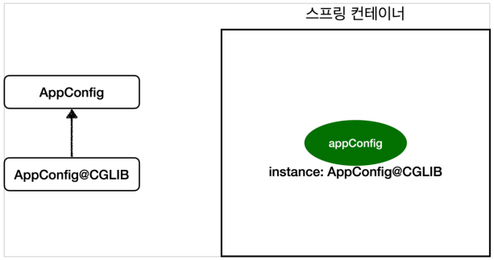

# 싱글톤 컨테이너
## 웹 애플리케이션과 싱글톤
- 스프링은 태생이 기업용 온라인 서비스 기술을 지원하기 위해 탄생했다.
- 대부분의 스프링 애플리케이션은 웹 애플리케이션이다. 물론 웹이 아닌 애플리케이션 개발도 얼마든지 가능하다.
- 웹 애플리케이션은 보통 여러 고객이 동시에 요청을 한다.


- 기존의 순수 자바인 AppConfig로 진행할 경우 위와 같은 그림의 구조로 작동한다.
- 고객 트패픽이 초당 100이면 초당 100개 객체가 생성되고 소멸되는데, 이는 메모리 낭비가 심하다.
- 이 낭비를 해결할 디자인 패턴으로 **'싱글톤 패턴'** 이 있다.

## 싱글톤 패턴
- 클래스의 인스턴스가 딱 1개만 생성되는 것을 보장하는 디자인 패턴이다.
- 그래서 객체 인스턴스를 2개 이상 생성하지 못하도록 막아야 한다.
    - private 생성자를 사용해서 외부에서 임의로 new 키워드를 사용하지 못하도록 막아야 한다.
    
```java
package hello.core.singleton;

public class SingletonService { 
    //1. static 영역에 객체를 딱 1개만 생성해둔다.
    private static final SingletonService instance = new SingletonService();

    //2. public으로 열어서 객체 인스터스가 필요하면 이 static 메서드를 통해서만 조회하도록 허용한다.
    public static SingletonService getInstance() {
        return instance;
    }

    //3. 생성자를 private으로 선언해서 외부에서 new 키워드를 사용한 객체 생성을 못하게 막는다.
        private SingletonService() {}

    public void logic() {
       System.out.println("싱글톤 객체 로직 호출");
    }
}
```

> 참고 : 싱글톤 패턴을 구현하는 방법은 여러가지가 있다. 그중에서 가장 단순하고 안전한 방법은 객체를 미리 생성해두는 것이다.

## 싱글톤 패턴의 문제점
- 싱글톤 패턴을 구현하는 코드 자체가 많이 들어간다.
- 의존관계상 클라이언트가 구체 클래스에 의존한다. -> DIP를 위반한다.
- 클라이언트가 궃 ㅔ클래스에 의존해서 OCP 원칙을 위반할 가능성이 높다.
- 테스트하기 어렵다.
- 내부 속성을 변경하거나 초기화 하기 어렵다.
- private 생성자로 자식 클래스를 만들기 어렵다.
- 결론적으로 유연성이 떨어진다.
- 안티패턴으로 불리기도 한다.

## 싱글톤 컨테이너
- 스프링 컨테이너는 싱글턴 패턴을 적용하지 않아도, 객체 인스턴스를 싱글톤으로 관리한다.
    - 이전에 설명한 컨테이너 생성 과정을 자세히 보자. 컨테이너는 객체 하나만 생성해서 관리한다.
- 스프링 컨테이너는 싱글톤 컨테이너 역할을 한다. 이렇게 싱글톤 객체를 생성하고 관리하는 기능을 싱글톤 레지스트라 한다.
- 스프링 컨테이너의 이런 기능 덕분에 싱글턴 패턴의 모든 단점을 해결하면서 객체를 싱글톤으로 유지할 수 있다.
    - 싱글톤 패턴을 위한 지저분한 코드가 들어가지 않아도 된다.
    - DIP, OCP, 테스트, private 생성자로 부터 자유롭게 싱글톤을 사용할 수 있다.

### 싱글톤 컨테이너 적용 후


> 참고 : 스프링의 기본 빈 등록 방식은 싱글톤이지만, 싱글톤 방식만 지원하는 것은 아니다. 요청할 때 마다 새로운 객체를 생성해서 반환하는 기능도 제공한다.

## 싱글톤 방식의 주의점.
- 싱글톤 패턴이나, 스프링의 싱글톤 컨테이너나 둘다, 객체 인스턴스를 하나만 생성해서 공유하는 방식이다. 즉, 여러 클라이언트가 하나의 같은 객체 인스턴스를 공유하기 때문에 싱글톤 객체는 상태를 유지(stateful)하게 설계하면 안된다.
- 무상태(stateless)로 설계해야 한다.
    - 특정 클라이언트에 의존적인 필드가 있으면 안된다.
    - 특정 클라이언트가 값을 변경할 수 있는 필드가 있으면 안된다.
    - 가급적 읽기만 가능해야한다.
    - 필드 대신에 자바에서 고유되지 않는 지역변수, 파라미터, ThreadLocal 등을 사용해야 한다.
- 스프링 빈의 필드에 공유 값을 설정하면 정말 큰 장애가 발생할 수 있다.

## @Configuration과 싱글톤
> 코드 구조만 보면, AppConfig를 직접 불러서 사용하는 것과 스프링 컨테이너를 통해서 사용하는 것과 별차이가 없어보인다. 그럼에도 불구하고, 테스트를 진행해보면, 스프링 컨테이너를 통해서 서비스를 호출할 경우, 싱글톤 컨테이너의 역할을 충실히 수행하는 것일 알 수 있다.

- 스프링 컨테이너는 싱글톤 레지스트리다. 따라서 스프링 빈이 싱글톤이 되도록 보장해주어야 한다. 스프링이 자바 코드까지 제어하는 것은 어렵기 때문에, 스프링은 클래스의 바이트코드를 조작하는 라이브러리를 사용한다. 모든 비밀은 `@Configuration`을 적용한 `AppConfig`에 있다.

```java
@Test
void congifurationDeep() {
    ApplicationContext ac = new AnnotationConfigApplicationContext(AppConfig.class);
    
    //AppConfig도 스프링 빈으로 등록된다.
    AppConfig bean = ac.getBean(AppConfig.class);
    
    System.out.println("bean = " + bean.getClass());
    //출력: bean = class hello.core.AppConfig$$EnhancerBySpringCGLIB$$bd479d70
}
``` 

- `AnnotationConfigApplicationContext`에 파라미터로 넘긴 값은 스프링 빈으로 등록된다. 그래서 `AppConfig`도 스프링 빈이 된다.
- `AppConfig` 스프링 빈을 조회해서 클래스 정보를 출력해보면, 다음과 같은 값이 출력도니다.
```java
bean = class hello.core.AppConfig$$EnhancerBySpringCGLIB$$bd479d70
```

> 위 출력값을 보면, 순수 클래스를 출력하는 것이 아니라 xxxCGLIB가 붙으며 뭔가 상당히 복잡해진 것을 볼 수 있는데, 이것은 내가 만든 클래스가 아니라, 스프링이 CGLIB라는 바이트코드 조작 라이브러리를 사용해서 AppConfig 클래스를 상속받은 임의의 다른 클래스를 만들고, 그 다른 클래스를 스프링 빈으로 등록한 것이다.



> 그 임의의 다른 클래스가 바로 싱글톤이 보장되도록 해준다.

### 정리
- @Bean만 사용해도 스프링 빈으로 등록되지만, 싱글톤을 보장하지 않는다.
- 크게 고민할 것 없이, 스프링 설정 정보는 항상 `@Congiguration`을 사용하자.