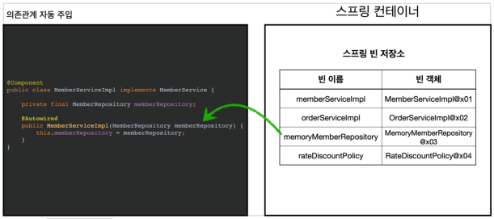
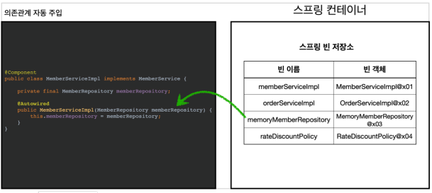
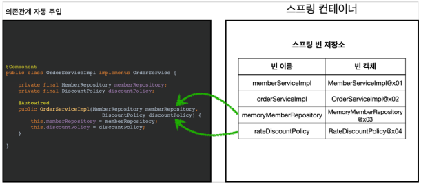

# 컴포넌트 스캔
## 목차

1. 컴포넌트 스캔 - 컴포넌트 스캔과 의존관계 자동 주입 시작하기
2. 컴포넌트 스캔 - 탐색 위치와 기본 스캔 대상
3. 컴포넌트 스캔 - 필터
4. 컴포넌트 스캔 - 중복 등록과 충돌

## 컴포넌트 스캔과 의존관계 자동 주입 시작하기

- 지금까지 스프링 빈을 등록할 땐, 자바 코드의 @Bean 이나 XML의 <bean> 등을 통해서 설정 정보에 직접 등록할 스프링 빈을 나열했다.
- 이렇게 등록, 관리해야할 빈의 수가 많아질 수록 무의미한 반복 작업이 늘어나고, 이 과정에서 누락하는 문제가 생길 여지도 있다.
- 그래서 스프링 설정 정보가 없어도 자동으로 스프링 빈을 등록하는 컴포넌트 스캔이라는 기능을 제공한다.
- 그래서 스프링은 설정 정보가 없어도 자동으로 스프링 빈을 등록하는 컴포넌트 스캔이라는 기능을 제공한다.
- 의존관계도 자동으로 주입하는 `@Autowired` 라는 기능도 제공한다.

> 컴포넌트 스캔을 사용하려면, 설정 클래스에 @ComponentScan을 붙여야 한다. 그 후 컴포넌트로 등록할 빈에 @Component 를 붙이면, 애플리케이션 작동시
> 알아서 인식을 해준다.
> 의존관계의 경우는 @Component를 선언한 클래스 안에서 의존성 주입을 하는 생성자에 @Autowired 를 선언하면 자동으로 의존성이 주입된다.

- `AnnotationConfigApplicationContext`를 사용하는 것은 기존 방식과 동일하다.
- 테스트코드 실행 시 다음과 같은 로그가 뜬다.
```java
ClassPathBeanDefinitionScanner - Identified candidate component class:
.. RateDiscountPolicy.class
.. MemberServiceImpl.class
.. MemoryMemberRepository.class
.. OrderServiceImpl.class
```

> 컴포넌트 스캔과 자동 의존관계 주입의 동작 방식은 다음 그림과 같다.
### 1. @ComponentScan

- `@ComponentScan`은 `@Component`가 붙은 모든 클래스를 스프링 빈으로 등록한다.
- 이때 스프링 빈의 기본 이름은 클래스명을 사용하되 맨 앞글자만 소문자를 사용한다.
    - **빈 이름 기본 값 :** MemberServiceImpl 클래스 -> memberServiceImpl
    - **빈 이름 직접 지정 :** 만약 스프링 빈의 이름을 직접 지정하고 싶으면 `@Component("memberService2")` 이런 식으로 지정하면 된다.
    
### 2. @Autowired 의존관계 자동 주입

- 생성자에 `@Autowired`를 지정하면, 스프링 컨테이너가 자동으로 해당 스프링 빈을 찾아서 주입한다.
- 이때 기본 조회 전략은 타입이 같은 빈을 찾아서 주입한다.
    - `getBean(MemberRepository.class)`와 동일하다고 이해하면 된다.


- 생성자에 파라미터가 많아도 다 찾아서 자동으로 주입한다.

## 탐색 위치와 기본 스캔 대상
### 탐색할 패키지의 시작 위치 지정
모든 자바 클래스를 다 컴포넌트 스캔하면 시간이 오래 걸린다. 그래서 꼭 필요한 위치부터 탐색하도록 시작 위치를 지정할 수 있다.
```java
@ComponentScan {
    basePackages = "hello.java.spring"
}
```
- `basePackages` : 탐색할 패키지의 시작 위치를 지정한다. 이 패키지를 포함해서 하위 패키지를 모두 탐색한다.
    - `basePackages = {"hello.core", "hello.service"}` 이렇게 여러 시작위치를 지정할 수 있다.
- `basePackageClassed` : 지정한 클래스의 패키지를 탐색 시작 위로 지정한다.
- 만약 지정하지 않으면 `@ComponentScan`ㅇ 붙은 설정 정보 클래스의 패키지가 시작 위치가 된다.

> 권장하는 방법은 패키지 위치를 지정하지 않고, 설정 정보 클래스의 위치를 프로젝트 최상단에 두는 것이다. 최근 스프링 부트도 이 방법을 기본으로
> 제공한다. 참고로 스프링 부트의 대표 시작 정보인 `@SpringBootApplication`를 이 프로젝트 시작 루트 위치에 두는 것이 관계이다. (그리고 이 설정 안에 바로 `@ComponentScan`이 들어있다.)

## 컴포넌트 스캔 기본 대상
컴포넌트 스캔은 `@Component` 뿐만 아니라 다음과 같은 내용도 추가로 대상에 포함한다.
- `@Component` : 컴포넌트 스캔에 사용
- `@Controller` : 스프링 MVC 컨트롤러에서 사용
- `@Service` : 스프링 비즈니스 로직에 사용
- `@Repository` : 스프링 데이터 접근 계층에서 사용
- `@Configuration` : 스프링 설정 정보에서 사용

해당 클래스의 소스 코드를 보면 `@Component`를 포함하고 있는 것을 알 수 있다.
```java
@Component
public @interface Controller {
}

@Component
public @interface Service {
}

@Component
public @interface Configuration {
}
```

> 참고로 애노테이션에는 상속관계라는 것이 없다. 특정 애노테이션을 들고 있는 것을 인식하는 것은 자바 언어가 지원하는 기능이 아니라, 스프링이 지원하는 기능이다.

컴포넌트 스캔의 용도 뿐만 아니라 다음 애노테이션이 있으면 스프링은 부가 기능을 수행한다.
- `@Controller` : 스프링 MVC 컨트롤러로 인식
- `@Repository` : 스프링 데이터 접근 계층으로 인식하고, 데이터 계층의 예외를 스프링 예외로 변환해준다.
- `@Configuration` : 스프링 설정 정보로 인식하고, 스프링 빈이 싱글톤을 유지하도록 추가 처리를 한다.
- `@Service` : 사실 `@Service`는 특별한 처리를 하지 않는다. 대신 개발자들이 핵심 비즈니스 로직이 여기에 있겠구나 라고 비즈니스 계층을 인식하는데 도움이 된다.

> 참고로 `userDefaultFilters` 옵션은 기본으로 켜져있는데, 이 옵션을 끄면 기본 스캔 대상들이 제외된다. 거의 쓰지 않는다. 그냥 안쓴다고 보고, 그냥 이런 옵션이 있구나 정도로만 알아두면 될듯.

## 필터
- `includeFilters` : 컴포넌트 스캔 대상을 추가로 지정한다.
- `excludeFilters` : 컴포넌트 스캔에서 제외할 대상을 지정한다.

### FilterType 옵션
- ANNOTATION : 기본값, 애노테이션을 인식해서 동작한다.
    - ex) `org.example.SomAnnotation`
- ASSIGNABLE_TYPE : 지정한 타입과 자식 타입을 인식해서 동작한다.
    - ex) `org.example.SomeClass`
- ASPECTJ : AspectJ 패턴 사용
    - ex) `org.example..*Service+`
- REGEX : 정규 표현식
    - ex) `org\.example\.Default.*`
- CUSTOM : `TypeFilter` 이라는 인터페이스를 구현해서 처리
    - ex) `org.example.MyTypeFilter`

> 참고: `@Component` 면 충분하기 때문에, `includeFilters` 를 사용할 일은 거의 없다. `excludeFilters`
  는 여러가지 이유로 간혹 사용할 때가 있지만 많지는 않다.
> 특히 최근 스프링 부트는 컴포넌트 스캔을 기본으로 제공하는데, 개인적으로는 옵션을 변경하면서 사용하기
보다는 스프링의 기본 설정에 최대한 맞추어 사용하는 것을 권장하고, 선호하는 편이다

## 중복 등록과 충돌

컴포넌트 스캔에서 같은 빈 이름을 등록하면 어떻게 될까?

1. 자동 빈 등록 vs 자동 빈 등록
2. 수동 빈 등록 vs 자동 빈 등록

### 자동 빈 등록 vs 자동 빈 등록
- 컴포넌트 스캔에 의해 자동으로 스프링 빈이 등록되는데, 그 이름이 같은 경우 스프링은 오류를 발생 시킨다.
    - `ConflictingBeanDefinitionException` 예외 발생

### 수동 빈 등록 vs 자동 빈 등록
- 스프링에선 수동 빈이 더 우선권을 가지기 때문에, 다음과 같은 로그를 남기고, 수동 빈으로 등록된다.
```java
Overriding bean definition for bean 'memoryMemberRepository' with a different definition: replacing
```

> 하지만, 개발자가 의도적으로 이러한 상황을 만드는 경우는 거의 없고, 있다 하더라도, 수많은 빈들이 상호작용하다보면, 오류가 생길 수 밖에 없다.
> 그래서 최근 스프링 부트에서는 수동 빈 등록과 자동 빈 등록이 충돌나면 오류가 발생하도록 기본 값을 바꾸었다.

```java
Consider renaming one of the beans or enabling overriding by setting spring.main.allow-bean-definition-overriding=true
```

스프링 부트인 `CoreApplication`을 실행해보면 오류를 볼 수 있다.